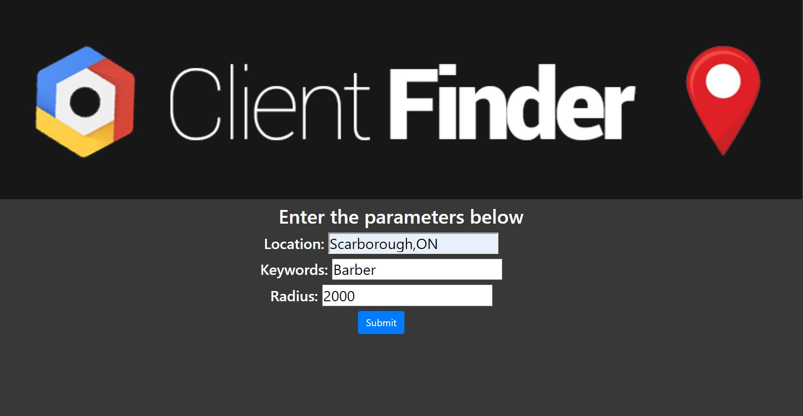

   
  

# Client Finder

 This program uses the Google Places API, and Python to read through the stored places in google's database, and then return the name and phone-number of places that do not have a website 

 This program was created to automate the task of finding clients for a web development company. It is very time taking to have to look through all the places on google, and then find places without a website. This program automates this task 

# Usage 
Web App: http://moizthedeveloper.pythonanywhere.com/
<ul>
  <li> Fill in the 3 parameters(Location,Keywords,Radius) </li>
  <li> Click submit, the program will then generate locations that do not have a website, that meet your keywords and radius</li>
</ul>

# Screenshots

    

